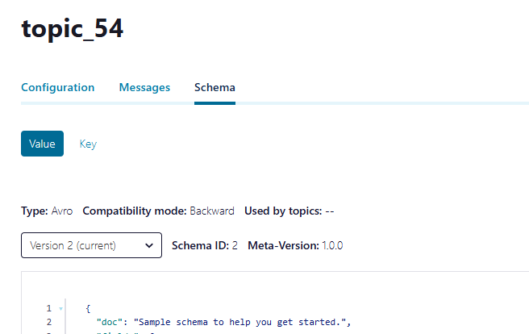

# C3 Proxy Proof-of-Concept

> Note: This repository is for showcasing only. This is not officially supported by Confluent

This is an example of how to inject client-side javascript using a proxy (nginx in this case) and modify the DOM.

Finding the right element to taget in your code can be tricky. The browser devtools allows you to execute JS statements. Use it to test your selectors:

```js
document.querySelector("[class^=ContentPanel] > div > div > div:nth-child(2)");
```

The code in this repository demonstrates how to add a custom version that is stored in the schema metadata to the schema page in Confluent Control Center (C3).




To test it using docker compose, run:

```
docker compose up --build
```